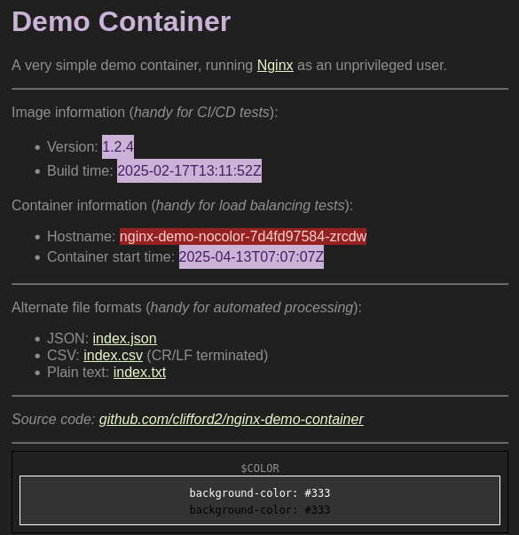

# Nginx Demo Container Image

## About

This code builds a very simple web server container image, which is handy for
[Continuous Deployment (CD)](https://en.wikipedia.org/wiki/Continuous_deployment)
and load balancing tests & demos.
It is running [nginx](https://nginx.org/) as a non root, unprivileged
user, on port 8080.

It returns simple content containing:

- The image version/tag (handy for CD tests & demos)
- The image build time (handy for CD tests & demos)
- Container hostname & start time (handy for load balancing & deployment rollout tests & demos)
- A coloured box, controlled by the optional `$COLOR` environment variable (handy visual aid for load balancing tests & demos)

This output is available in the following formats:

- HTML: `index.html` (handy for human consumption)
- JSON: `index.json` (ideal for automated processing)
- Plain text: `index.txt` (LF terminated)
- Comma-separated values: `index.csv` (CR/LF terminated)

An image built from this code is available at
[`ghcr.io/clifford2/nginx-demo`](https://ghcr.io/clifford2/nginx-demo).

## Using The Image

Example Kubernetes manifests are available in `deploy/k8s-${version}.yaml`.
The latest version is also available in [`deploy/k8s-latest.yaml`](deploy/k8s-latest.yaml).
Deploy with:

```sh
kubectl apply -f https://raw.githubusercontent.com/clifford2/nginx-demo-container/refs/heads/main/deploy/k8s-latest.yaml
```

Demonstrate [Kubernetes rolling update](https://kubernetes.io/docs/tutorials/kubernetes-basics/update/update-intro/) with these commands to change the `$COLOR` of 2 of the deployments:

```sh
kubectl patch deployment nginx-demo-blue -p '{"spec":{"template":{"spec":{"containers":[{"name":"nginx-demo","env":[{"name":"COLOR","value":"#1F63E0"}]}]}}}}'
kubectl patch deployment nginx-demo-green -p '{"spec":{"template":{"spec":{"containers":[{"name":"nginx-demo","env":[{"name":"COLOR","value":"#3BC639"}]}]}}}}'
watch kubectl get deployments,pods -l app.kubernetes.io/name=nginx-demo
```

You can also run the image locally with commands like this:

```shell
$ podman run -d --rm \
   -p 8081:8080 \
   --name nginx-demo-nocolor \
   ghcr.io/clifford2/nginx-demo:1.8.1
$ podman run -d --rm \
   -p 8082:8080 \
   --name nginx-demo-blue \
   -e COLOR=blue \
   ghcr.io/clifford2/nginx-demo:1.8.1
$ podman run -d --rm \
   -p 8083:8080 \
   --name nginx-demo-green \
   -e COLOR=green \
   ghcr.io/clifford2/nginx-demo:1.8.1
$ podman run -d --rm \
   -p 8084:8080 \
   --name nginx-demo-red \
   -e COLOR=red \
   ghcr.io/clifford2/nginx-demo:1.8.1

$ xdg-open http://127.0.0.1:8081/index.html
$ curl http://127.0.0.1:8082/index.json
$ curl http://127.0.0.1:8083/index.txt
$ curl http://127.0.0.1:8084/index.csv

$ podman stop nginx-demo-nocolor nginx-demo-red nginx-demo-blue nginx-demo-green
```

## License & Disclaimer

This code is shared under the MIT No Attribution License.
It is provided *AS IS*, without warranty of any kind.
See [`LICENSES/MIT-0.txt`](LICENSES/MIT-0.txt) for the full license text and disclaimer.

## Security

This is a demo, provided for educational purposes only.

While it is updated as often as possible, support is provided on a best effort basis only.

Please report any problems or vulnerabilities by opening a [GitHub issue here](https://github.com/clifford2/nginx-demo-container/issues).

## Output Samples

Here are some output examples from November 2025 (different code releases).

HTML:



JSON:

```json
{
  "image_version": "1.7.11",
  "build_time": "2025-11-15T05:58:19Z",
  "container_hostname": "eeb54793d9e6",
  "start_time": "2025-11-15T06:09:01Z",
  "color": "#333",
  "nginx_version": "1.29.2",
  "opencontainers_annotations": {
    "org.opencontainers.image.authors": "Clifford Weinmann <https://www.cliffordweinmann.com/>",
    "org.opencontainers.image.created": "2025-11-15T05:58:19Z",
    "org.opencontainers.image.description": "NGINX Demo",
    "org.opencontainers.image.licenses": "MIT-0",
    "org.opencontainers.image.revision": "9243706706f0b74a5aa6f33d94f1848fc205d3f2",
    "org.opencontainers.image.source": "https://github.com/clifford2/nginx-demo-container",
    "org.opencontainers.image.title": "nginx-demo-container",
    "org.opencontainers.image.url": "https://github.com/clifford2/nginx-demo-container",
    "org.opencontainers.image.version": "1.7.11"
  }
}
```

CSV:

```csv
"image_version","1.5.1"
"build_time","2025-11-13T13:22:22Z"
"container_hostname","330e9917d50f"
"start_time","2025-11-13T13:37:39Z"
"color","#1F63E0"
```

Plain text:

```text
image_version:1.7.11
build_time:2025-11-15T05:58:19Z
container_hostname:eeb54793d9e6
start_time:2025-11-15T06:09:01Z
color:#333
nginx_version:1.29.2
```
