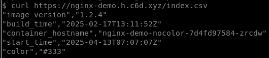
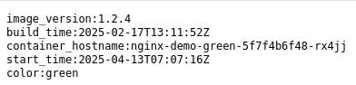

# Nginx Demo Container Image

## About

A very simple demo container image, running [Nginx](https://nginx.org/)
as a non root, unprivileged user, on port 8080.

It returns simple files which contain:

- The image version/tag (handy for CI/CD tests & demos)
- The image build time (handy for CI/CD tests & demos)
- Container hostname & start time (handy for load balancing tests & demos)

This output is available in the following files / formats:

- HTML: `index.html` (handy for human consumption)
- JSON: `index.json` (ideal for automated processing)
- Plain text: `index.txt` (LF terminated)
- Comma-separated values: `index.csv` (CR/LF terminated)

An image built from this code is available at
[`ghcr.io/clifford2/nginx-demo`](https://ghcr.io/clifford2/nginx-demo).

## Using The Image

You can run the image locally with:

```sh
podman run -d --rm -p 8081:8080 --name nginx-demo-red ghcr.io/clifford2/nginx-demo:1.3.2
podman run -d --rm -p 8082:8080 --name nginx-demo-blue -e COLOR=blue ghcr.io/clifford2/nginx-demo:1.3.2
podman run -d --rm -p 8083:8080 --name nginx-demo-green -e COLOR=green ghcr.io/clifford2/nginx-demo:1.3.2
curl http://127.0.0.1:8081/index.json
curl http://127.0.0.1:8082/index.txt
curl http://127.0.0.1:8083/index.csv
podman stop nginx-demo-red nginx-demo-blue nginx-demo-green
```

Example Kubernetes manifests are also available in `deploy/k8s-{version}.yaml`. Deploy with:

```sh
kubectl apply -f https://raw.githubusercontent.com/clifford2/nginx-demo-container/refs/heads/main/deploy/k8s-latest.yaml
```

## License & Disclaimer

This code is shared under the MIT No Attribution License.
It is provided *AS IS*, without warranty of any kind.
See [`LICENSES/MIT-0.txt`](LICENSES/MIT-0.txt) for the full license text and disclaimer.

## Security

This is a demo, provided for educational purposes only.

While it is updated as often as possible, support is provided on a best effort basis only.

Please report any problems or vulnerabilities by opening a [GitHub issue here](https://github.com/clifford2/nginx-demo-container/issues).

## Output Samples

Here are some output examples from v1.2.4.

HTML:


JSON:


CSV:



Plain text:


