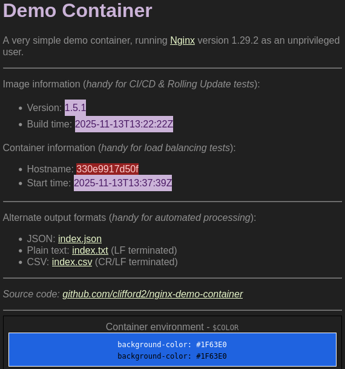
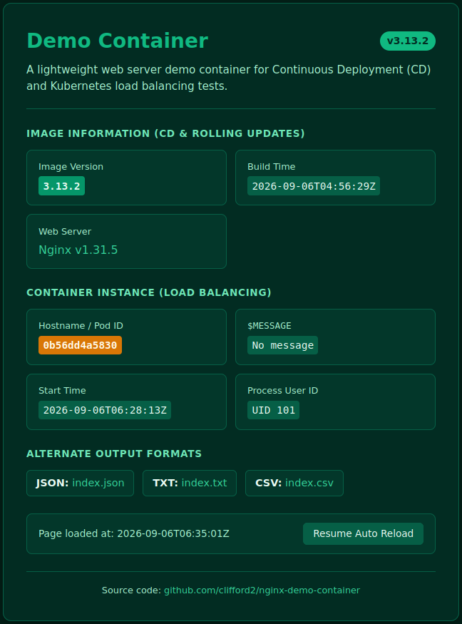

# Nginx Demo Container Image

## About

This code builds three very simple HTTP server container images, which are handy for
[Continuous Deployment](https://en.wikipedia.org/wiki/Continuous_deployment) (CD) and
[Load balancing](https://en.wikipedia.org/wiki/Load_balancing_(computing)) tests & demos.
It is running the [nginx](https://nginx.org/) HTTP web server as a non root,
unprivileged user, on port 8080.

The container returns simple content containing:

- The image version/tag (handy for CD tests & demos)
- The image build time (handy for CD tests & demos)
- Container hostname & start time (handy for load balancing & deployment rollout tests & demos)
- A customizable area:
	- For v1 images, a coloured box, controlled by the optional `$COLOR` environment variable (handy visual aid for load balancing tests & demos)
	- For v2 & v3 images, a message box, where a text message from the optional `$MESSAGE` environment variable will be displayed

This output is available in the following formats:

- HTML: `index.html` (handy for human consumption)
- JSON: `index.json` (ideal for automated processing)
- Plain text: `index.txt` (LF terminated)
- Comma-separated values: `index.csv` (CR/LF terminated)

## Using The Images

### Basic Kubernetes Deployment

Example Kubernetes manifests are available in `deploy/deployment-v*.yaml`.

Deploy the latest version to your Kubernetes cluster with:

```sh
# Create 3 Deployments with different custom attribites
kubectl apply -f \
  https://raw.githubusercontent.com/clifford2/nginx-demo-container/refs/heads/main/deploy/deployment-v3.yaml
```

*Note that the `startupProbe` timing is intentionally longer than necessary to allow us to observe the transitions.*

### Accessing The Service

#### Service

Create a service to expose the application. Options include:

```sh
# Create ClusterIP Service
kubectl apply -f \
  https://raw.githubusercontent.com/clifford2/nginx-demo-container/refs/heads/main/deploy/service-clusterip.yaml
# Create NodePort Service
kubectl apply -f \
  https://raw.githubusercontent.com/clifford2/nginx-demo-container/refs/heads/main/deploy/service-nodeport.yaml
# Create LoadBalancer Service
kubectl apply -f \
  https://raw.githubusercontent.com/clifford2/nginx-demo-container/refs/heads/main/deploy/service-loadbalancer.yaml
```

**Note:**

> You could now access the service by port fowarding it to your device, with a command like this:
> `kubectl port-forward service/nginx-demo 9090:8080`
> This will prove that the service is running, but not provide any Service-level load balancing,
> as `kubectl port-forward` establishes a direct point-to-point tunnel to one single target pod.

#### Ingress / OpenShift Route

Depending on youe Kubernetes cluster, you can expose the service outside the cluster, with one of:

```sh
# Create Ingress (substitute `${YOUR_DOMAIN}`)
curl --silent \
  https://raw.githubusercontent.com/clifford2/nginx-demo-container/refs/heads/main/deploy/ingress.yaml \
  | sed -e "s/ host: .*/ host: nginx-demo.${YOUR_DOMAIN}/" > /tmp/ingress.yaml
# Review the /tmp/ingress.yaml file to match your cluster (check `ingressClassName` etc), then:
kubectl apply -f /tmp/ingress.yaml

# Alternate: create OpenShift Route
kubectl apply -f \
  https://raw.githubusercontent.com/clifford2/nginx-demo-container/refs/heads/main/deploy/openshift-route.yaml
```

#### Minikube

*Doc: [Accessing apps](https://minikube.sigs.k8s.io/docs/handbook/accessing/)*

In Minikube, if you created a LoadBalancer Service, you can access it by running:

```sh
minikube tunnel
```

In a different terminal, run this to get the external IP where you can access it:

```shell
$ kubectl get svc -l app.kubernetes.io/name=nginx-demo
NAME         TYPE           CLUSTER-IP     EXTERNAL-IP    PORT(S)          AGE
nginx-demo   LoadBalancer   10.104.3.199   10.104.3.199   8080:31066/TCP   11h
```

In this example, the service should not be accessible at `http://10.104.3.199:8080/`.

#### Kind

*Doc: [Quick Start](https://kind.sigs.k8s.io/docs/user/configuration/)*

In kind (Kubernetes in Docker), you can map extra ports from the nodes to the host machine.

To do this, create the cluster with:

```sh
wget https://raw.githubusercontent.com/clifford2/nginx-demo-container/refs/heads/main/deploy/kind-config.yaml
wget https://raw.githubusercontent.com/clifford2/nginx-demo-container/refs/heads/main/deploy/service-kind.yaml
kind create cluster --config kind-config.yaml
kubectl apply -f service-kind.yaml
```

The service should now be accessible at `http://127.0.0.1:30080/`.

### Kubernetes Rolling Update Demo

To demonstrate [Kubernetes rolling update](https://kubernetes.io/docs/tutorials/kubernetes-basics/update/update-intro/), try these steps:

```sh
# Deploy version 1 of the image:
kubectl apply -f https://raw.githubusercontent.com/clifford2/nginx-demo-container/refs/heads/main/deploy/deployment-v1.yaml
# Port forward the service to your device so you can access it locally
# (replace port 9090 to suite your needs):
kubectl port-forward service/nginx-demo 9090:8080
# Connect to the service with a web browser (http://0.0.0.0:9090), and reload
# a few times to see the load balancing between the 3 deployments.
#
# Change the `$COLOR` of 2 of the deployments:
kubectl patch deployment nginx-demo-2 -p '{"spec":{"template":{"spec":{
"containers":[{"name":"nginx-demo","env":[{"name":"COLOR","value":"#1F63E0"}]}]
}}}}'

kubectl patch deployment nginx-demo-3 -p '{"spec":{"template":{"spec":{
"containers":[{"name":"nginx-demo","env":[{"name":"COLOR","value":"#3BC639"}]}]
}}}}'
# Watch the rollout happen (Ctrl-C to stop),
# while also reloading the web page to see the effects:
watch -n 1 kubectl get deployments,pods -l app.kubernetes.io/name=nginx-demo

# Upgrade to version 2 of the image:
kubectl apply -f https://raw.githubusercontent.com/clifford2/nginx-demo-container/refs/heads/main/deploy/deployment-v2.yaml
# Watch the rollout happen (Ctrl-C to stop),
# while also reloading the web page to see the effects:
watch -n 1 kubectl get deployments,pods -l app.kubernetes.io/name=nginx-demo

# Upgrade to version 3 of the image:
kubectl apply -f https://raw.githubusercontent.com/clifford2/nginx-demo-container/refs/heads/main/deploy/deployment-v3.yaml
# Watch the rollout happen (Ctrl-C to stop),
# while also reloading the web page to see the effects:
watch -n 1 kubectl get deployments,pods -l app.kubernetes.io/name=nginx-demo
```

### Failed Container Restart

To test the liveness probe & automatic restart of a pod, remove the
`healthz.json` file so that the probe fails:

```sh
kubectl get pods -l app.kubernetes.io/name=nginx-demo
kubectl exec <podname> -- rm /usr/share/nginx/html/healthz.json
watch -n 1 kubectl get deployments,pods -l app.kubernetes.io/name=nginx-demo
```

### Deploy With Podman or Docker

You can also test the image without Kubernetes, using Podman or Docker,
with commands like this (replace `podman` with `docker` if desired):

```shell
$ podman run -d --rm \
   -p 127.0.0.1:9091:8080 \
   --name nginx-demo-1 \
   ghcr.io/clifford2/nginx-demo:3.13.2
$ podman run -d --rm \
   -p 127.0.0.1:9092:8080 \
   --name nginx-demo-2 \
   -e MESSAGE=Blue \
   ghcr.io/clifford2/nginx-demo:3.13.2
$ podman run -d --rm \
   -p 127.0.0.1:9093:8080 \
   --name nginx-demo-3 \
   -e MESSAGE=Green \
   ghcr.io/clifford2/nginx-demo:3.13.2
$ podman run -d --rm \
   -p 127.0.0.1:9094:8080 \
   --name nginx-demo-4 \
   -e MESSAGE=Red \
   ghcr.io/clifford2/nginx-demo:3.13.2

$ gio open http://127.0.0.1:9091/index.html
$ curl http://127.0.0.1:9092/index.json | jq '.'
$ curl http://127.0.0.1:9093/index.txt
$ curl http://127.0.0.1:9094/index.csv

$ podman stop nginx-demo-1 nginx-demo-2 nginx-demo-3 nginx-demo-4
```

## Output Samples

Here are some output examples from November 2025 (different code releases).

HTML (v1):



HTML (v3):



JSON (v3, 2026-09):

```json
{
  "image_info": {
    "image_version": "3.13.2",
    "build_time": "2026-09-06T04:56:29Z",
    "nginx_version": "1.31.5"
  },
  "container_info": {
    "container_hostname": "901def740287",
    "running_as_uid": "101",
    "start_time": "2026-09-06T06:28:18Z",
    "message": "Blue"
  },
  "opencontainers_annotations": {
    "org.opencontainers.image.authors": "Clifford Weinmann <https://www.cliffordweinmann.com/>",
    "org.opencontainers.image.created": "2026-09-06T04:56:29Z",
    "org.opencontainers.image.description": "NGINX Demo",
    "org.opencontainers.image.licenses": "MIT-0",
    "org.opencontainers.image.revision": "166a361b34d1afd3c8b53143819f0d5bca65e21a",
    "org.opencontainers.image.source": "https://github.com/clifford2/nginx-demo-container",
    "org.opencontainers.image.title": "nginx-demo-container",
    "org.opencontainers.image.url": "https://github.com/clifford2/nginx-demo-container",
    "org.opencontainers.image.version": "3.13.2"
  }
}
```

CSV (v2, 2026-09):

```csv
"image_version","2.13.2"
"build_time","2026-09-06T04:56:29Z"
"nginx_version","1.31.5"
"container_hostname","91aa91bf21e6"
"running_as_uid","101"
"start_time","2026-09-06T06:33:45Z"
"message","No message"
```

Plain text (v1, 2025-11):

```text
image_version:1.7.11
build_time:2025-11-15T05:58:19Z
container_hostname:eeb54793d9e6
start_time:2025-11-15T06:09:01Z
color:#333
nginx_version:1.29.2
```

## Building The Image

Images built from this code are available at
[`ghcr.io/clifford2/nginx-demo`](https://ghcr.io/clifford2/nginx-demo).

If you prefer to build your own container images, there are a couple of ways to do that, namely:

- Build manually, using [GNU Make](https://www.gnu.org/software/make/), by running `make build-release && make test-release`
- With [GitHub Actions](https://github.com/features/actions) - sample configuration available in [`.github/workflows/build-image.yaml`](.github/workflows/build-image.yaml)
- With [Jenkins](https://www.jenkins.io/) - sample configuration available in [`Jenkinsfile`](Jenkinsfile)
- With an [Azure DevOps Pipeline](https://azure.microsoft.com/en-us/products/devops/pipelines) - sample configuration available in [`azure-pipelines.yml`](azure-pipelines.yml) 
- With [GitLab CI/CD pipelines](https://docs.gitlab.com/ci/pipelines/) - sample configuration available in [`.gitlab-ci.yml`](.gitlab-ci.yml)

## License & Disclaimer

This code is shared under the MIT No Attribution License.
It is provided *AS IS*, without warranty of any kind.
See [`LICENSES/MIT-0.txt`](LICENSES/MIT-0.txt) for the full license text and disclaimer.

## Security

This is a demo, provided for educational purposes only.

While it is updated as often as possible, support is provided on a best effort basis only.

Please report any problems or vulnerabilities by opening a [GitHub issue here](https://github.com/clifford2/nginx-demo-container/issues).
